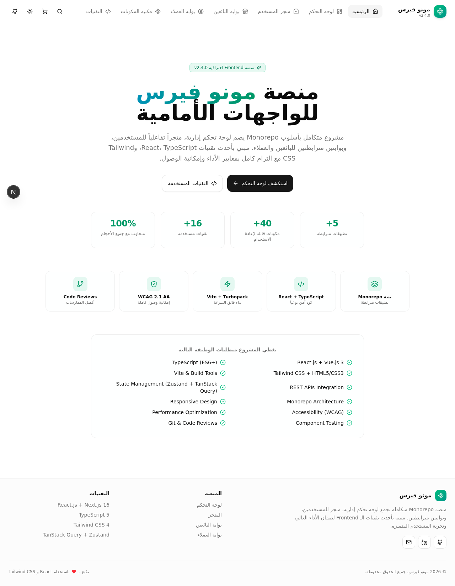
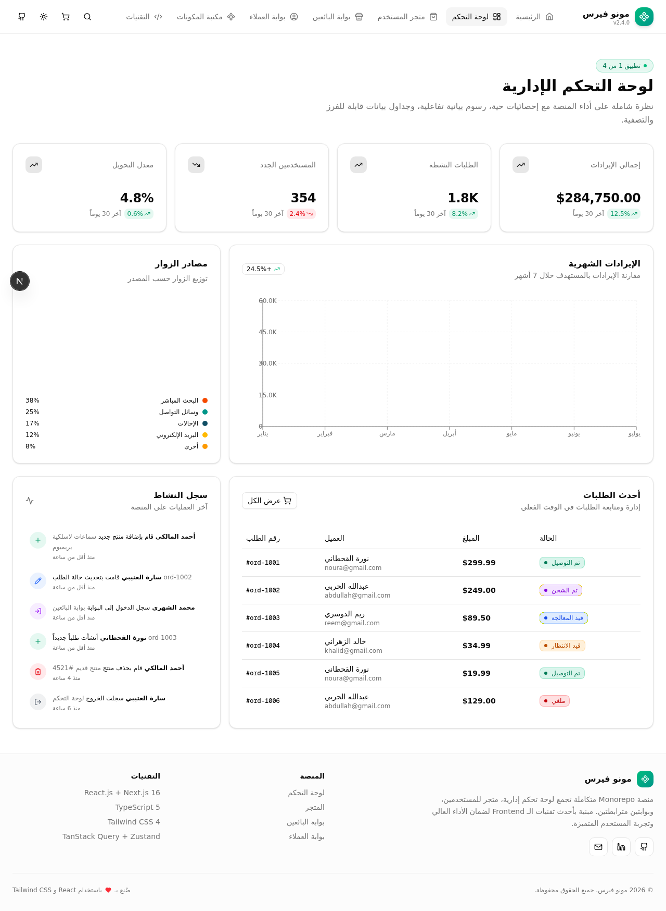
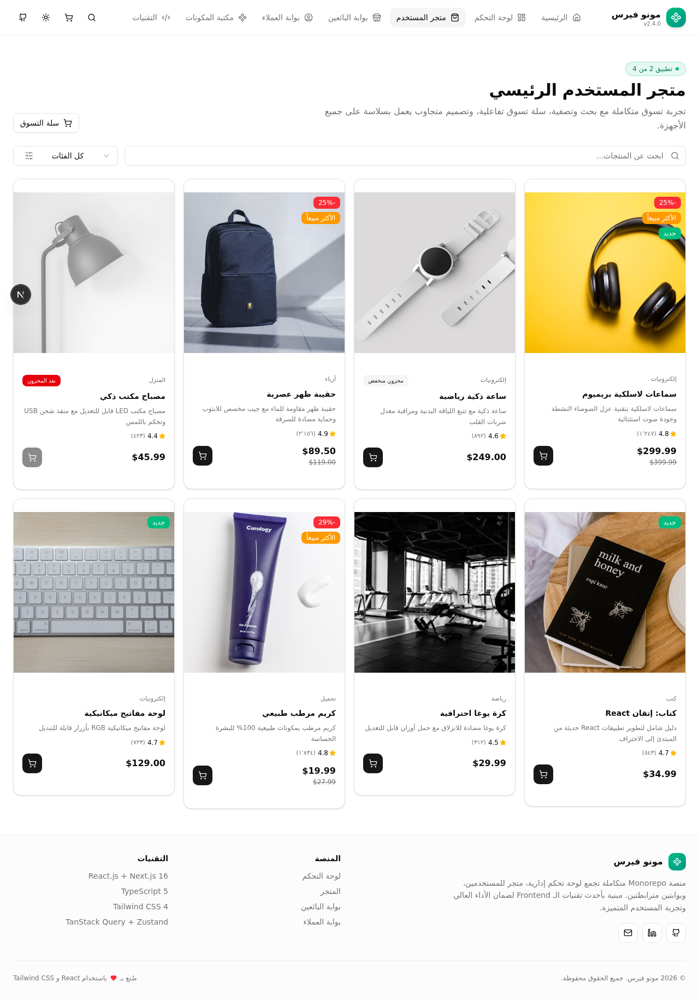
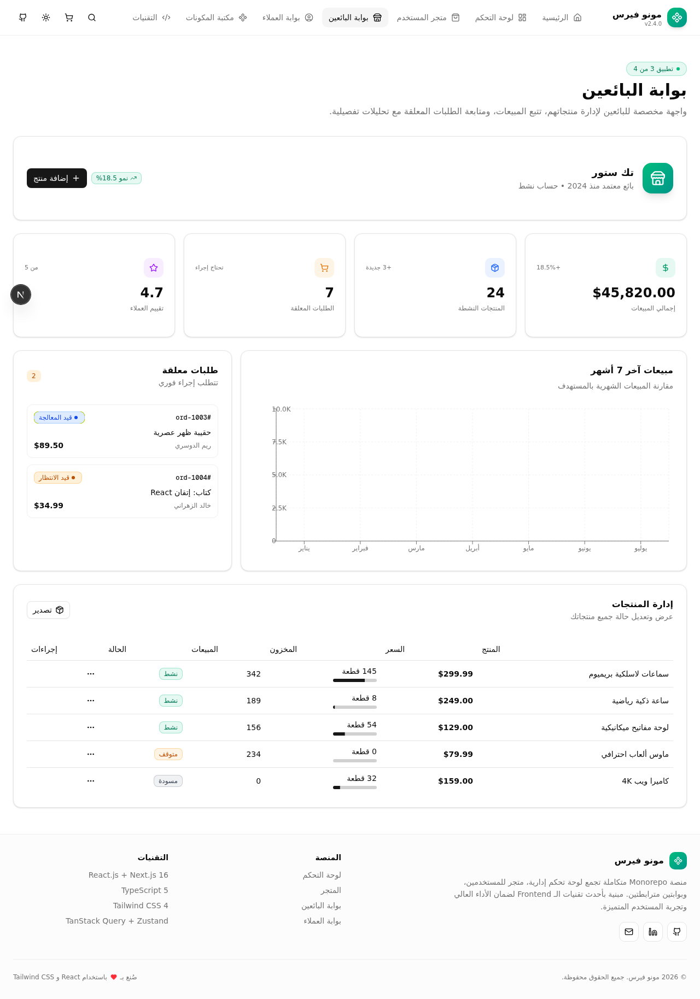
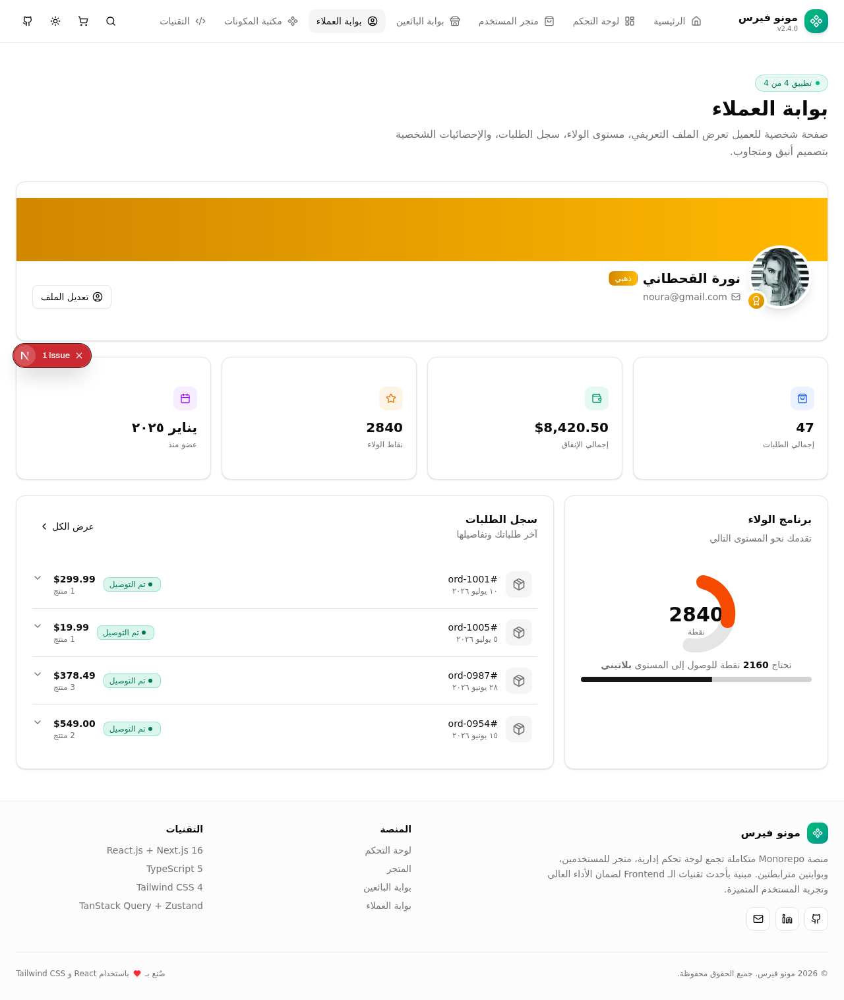
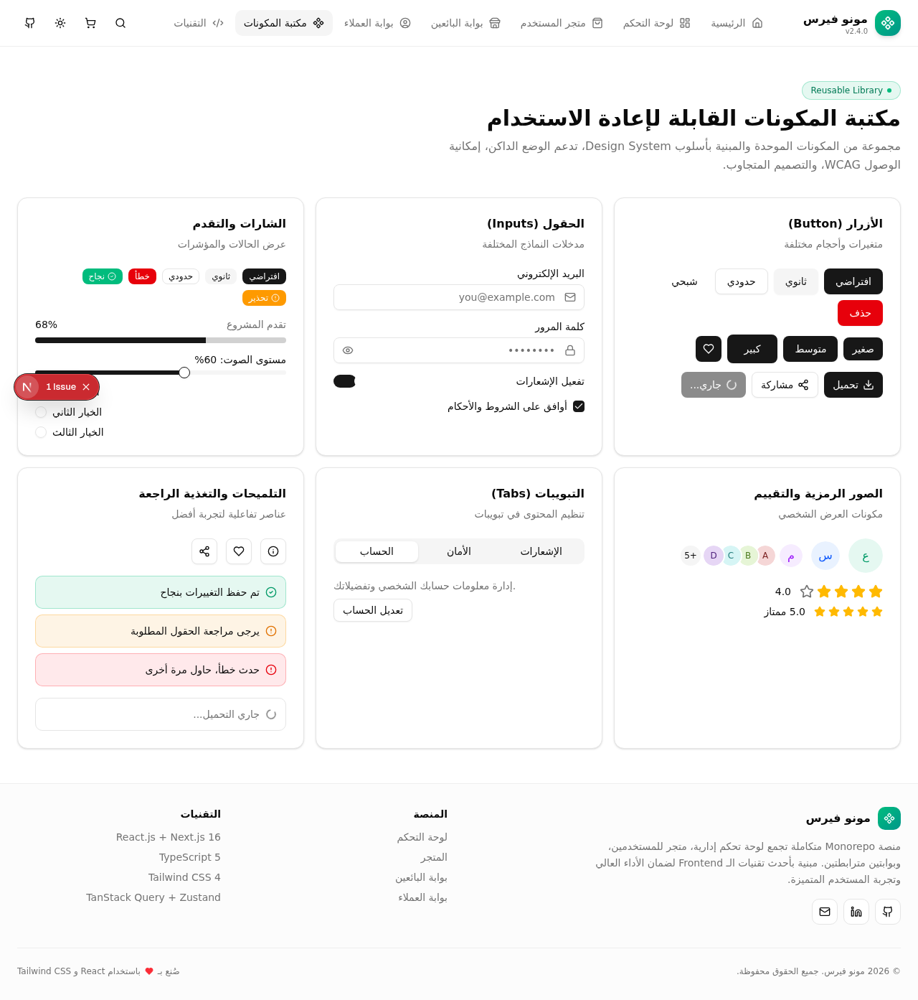
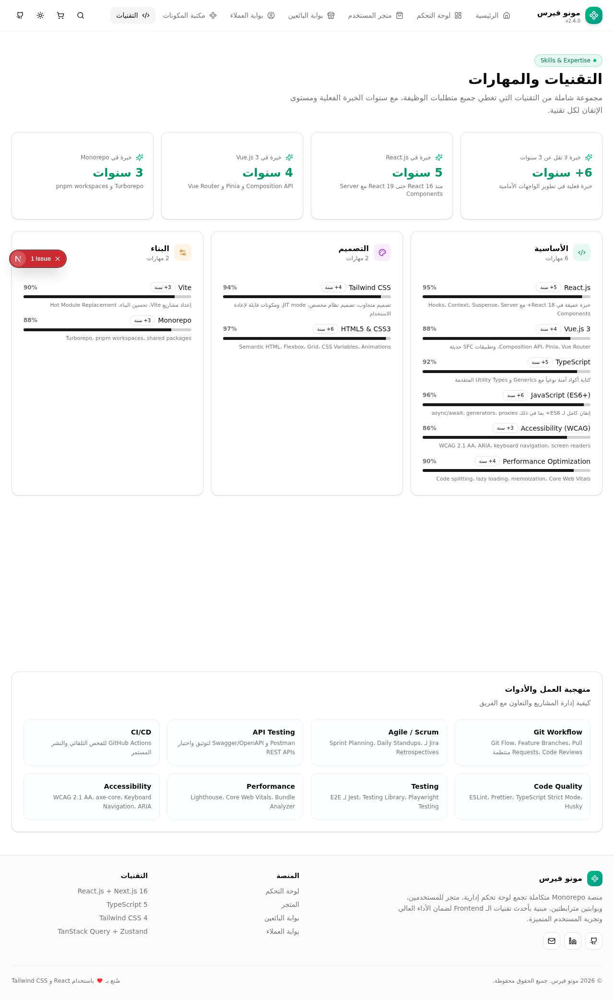
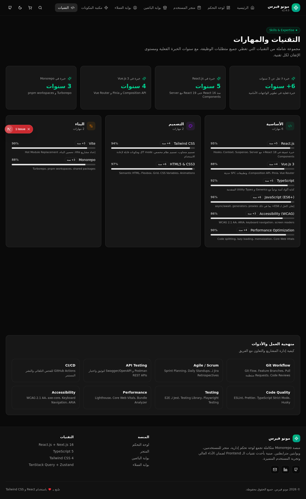

# 🚀 مونو فيرس | منصة مطور الواجهات الأمامية

<div align="center">


**منصة Monorepo متكاملة تضم 4 تطبيقات مترابطة + مكتبة مكونات قابلة لإعادة الاستخدام**

</div>

---

## 📸 لقطات من الموقع

### 🏠 الصفحة الرئيسية


### 📊 لوحة التحكم الإدارية


### 🛒 متجر المستخدم


### 🏪 بوابة البائعين


### 👤 بوابة العملاء


### 📚 مكتبة المكونات


### 🛠️ التقنيات والمهارات


### 🌙 الوضع الداكن


---

## 📋 نظرة عامة

منصة **مونو فيرس** هي مشروع احترافي متكامل بأسلوب **Monorepo** يجمع عدة تطبيقات مترابطة في مشروع واحد، صُمم لعرض مهارات مطور الواجهات الأمامية بشكل عملي وشامل. يغطي المشروع جميع متطلبات وظيفة **Frontend Developer** بدءاً من React و TypeScript، مروراً بإدارة الحالة وتكامل REST APIs، وصولاً إلى إمكانية الوصول وتحسين الأداء.

## 🎯 التطبيقات المترابطة

المشروع يحتوي على **4 تطبيقات** في منصة واحدة + قسمين إضافيين:

| # | التطبيق | الوصف |
|---|---------|--------|
| 1️⃣ | **لوحة التحكم الإدارية** | إحصائيات حية، رسوم بيانية تفاعلية، جداول بيانات، سجل نشاط |
| 2️⃣ | **متجر المستخدم الرئيسي** | كتالوج منتجات، بحث وتصفية، سلة تسوق تفاعلية كاملة |
| 3️⃣ | **بوابة البائعين** | إدارة المنتجات، تتبع المبيعات، الطلبات المعلقة |
| 4️⃣ | **بوابة العملاء** | ملف شخصي، برنامج ولاء، سجل الطلبات |
| 📚 | **مكتبة المكونات** | عرض المكونات القابلة لإعادة الاستخدام |
| 🛠️ | **التقنيات والمهارات** | عرض التقنيات المستخدمة مع مستوى الإتقان |

## ✨ الميزات

### 🏗️ البنية المعمارية
- ✅ **بنية Monorepo** مع تطبيقات مترابطة
- ✅ **Design System** موحد مع مكتبة مكونات
- ✅ فصل واضح للمسؤوليات (API / Hooks / Components / Types)
- ✅ كود نظيف ومنظم مع TypeScript Strict Mode

### 🎨 واجهة المستخدم
- ✅ **تصميم متجاوب 100%** (Mobile-first approach)
- ✅ **دعم كامل للوضع الداكن** (Dark Mode)
- ✅ **دعم RTL** كامل للغة العربية
- ✅ **حركات وانتقالات** سلسة باستخدام Framer Motion
- ✅ **حالات التحميل** (Skeletons) والتعامل مع الأخطاء

### 🔌 تكامل البيانات
- ✅ **6 REST API Routes** مبنية مع Next.js
- ✅ **TanStack Query** لإدارة حالة الخادم (caching, retries, optimistic updates)
- ✅ **Zustand** لإدارة حالة العميل (cart, navigation, UI state)
- ✅ **API Client** مخصص مع timeout وإعادة المحاولة

### ♿ إمكانية الوصول (Accessibility)
- ✅ **WCAG 2.1 AA** compliant
- ✅ **Semantic HTML** (main, header, nav, section, article)
- ✅ **ARIA labels** كاملة للعناصر التفاعلية
- ✅ **دعم لوحة المفاتيح** الكامل
- ✅ **Screen Reader** support

### ⚡ الأداء
- ✅ **Code Splitting** و Lazy Loading
- ✅ **Image Optimization** مع Next.js
- ✅ **Memoization** للمكونات والقيم
- ✅ **Persistent State** مع localStorage

## 🛠️ التقنيات المستخدمة

### Core
- **[Next.js 16](https://nextjs.org/)** - إطار العمل الأساسي (App Router)
- **[React 19](https://react.dev/)** - مكتبة الواجهات
- **[TypeScript 5](https://www.typescriptlang.org/)** - للأمان النوعي
- **JavaScript (ES6+)** - ميزات حديثة

### Styling & UI
- **[Tailwind CSS 4](https://tailwindcss.com/)** - إطار التصميم
- **[shadcn/ui](https://ui.shadcn.com/)** - مكتبة المكونات (40+ مكون)
- **[Radix UI](https://www.radix-ui.com/)** - primitives لإمكانية الوصول
- **[Lucide Icons](https://lucide.dev/)** - الأيقونات
- **[Framer Motion](https://www.framer.com/motion/)** - الحركات

### State Management
- **[TanStack Query](https://tanstack.com/query)** - إدارة حالة الخادم
- **[Zustand](https://github.com/pmndrs/zustand)** - إدارة حالة العميل
- **React Context** - للحالة العامة

### Data Visualization
- **[Recharts](https://recharts.org/)** - الرسوم البيانية
- **Area Charts, Bar Charts, Pie Charts, Radial Charts**

### Development Tools
- **[Vite](https://vitejs.dev/)** / Turbopack - أدوات البناء
- **[ESLint](https://eslint.org/)** - فحص الكود
- **Git** - إدارة الإصدارات

## 📁 بنية المشروع

```
src/
├── app/                    # Next.js App Router
│   ├── api/               # REST API Routes
│   │   ├── dashboard/     # بيانات لوحة التحكم
│   │   ├── products/      # المنتجات
│   │   ├── orders/        # الطلبات
│   │   ├── users/         # المستخدمين
│   │   ├── vendor/        # بيانات البائعين
│   │   └── customer/      # بيانات العملاء
│   ├── layout.tsx         # التخطيط الرئيسي
│   ├── page.tsx           # الصفحة الرئيسية
│   └── globals.css        # الأنماط العامة
│
├── components/
│   ├── ui/                # مكتبة shadcn/ui (40+ مكون)
│   ├── shared/            # مكونات مشتركة قابلة لإعادة الاستخدام
│   │   ├── stat-card.tsx
│   │   ├── product-card.tsx
│   │   ├── filter-bar.tsx
│   │   ├── status-badge.tsx
│   │   └── section-heading.tsx
│   ├── sections/          # أقسام التطبيق
│   │   ├── hero-section.tsx
│   │   ├── admin-dashboard.tsx
│   │   ├── user-store.tsx
│   │   ├── vendor-portal.tsx
│   │   ├── customer-portal.tsx
│   │   ├── component-library.tsx
│   │   └── tech-stack.tsx
│   ├── layout/            # مكونات التخطيط
│   │   ├── navbar.tsx
│   │   └── footer.tsx
│   └── theme/             # مكونات الثيم
│       ├── theme-provider.tsx
│       ├── theme-toggle.tsx
│       └── query-provider.tsx
│
├── hooks/                 # Custom Hooks
│   ├── use-api.ts         # Hooks لاستدعاء APIs
│   ├── use-app-store.ts   # Zustand store
│   ├── use-toast.ts
│   └── use-mobile.ts
│
├── lib/                   # المساعدات والأدوات
│   ├── api-client.ts      # REST API client
│   ├── constants.ts       # الثوابت والإعدادات
│   ├── mock-data.ts       # البيانات التجريبية
│   ├── db.ts              # Prisma client
│   └── utils.ts           # دوال مساعدة
│
└── types/                 # TypeScript Types
    └── index.ts
```

## 🚀 التثبيت

### المتطلبات
- Node.js 18+
- npm / yarn / bun

### الخطوات

```bash
# 1. استنساخ المستودع
git clone https://github.com/EngKHALIDx/Frontend-Developer-web.git

# 2. الدخول للمجلد
cd Frontend-Developer-web

# 3. تثبيت الحزم
npm install
# أو
yarn install
# أو
bun install

# 4. تشغيل خادم التطوير
npm run dev
# أو
yarn dev
# أو
bun run dev

# 5. افتح المتصفح على
http://localhost:3000
```

### بناء الإنتاج

```bash
npm run build
npm run start
```

## 📊 نقاط النهاية (API Endpoints)

| Method | Endpoint | الوصف |
|--------|----------|--------|
| `GET` | `/api/dashboard` | إحصائيات وبيانات لوحة التحكم |
| `GET` | `/api/products` | قائمة المنتجات (مع تصفية وبحث) |
| `GET` | `/api/orders` | قائمة الطلبات (مع تصفية بالحالة) |
| `GET` | `/api/users` | قائمة المستخدمين |
| `GET` | `/api/vendor` | بيانات بوابة البائعين |
| `GET` | `/api/customer` | بيانات بوابة العملاء |

### معاملات الاستعلام (Query Parameters)

```bash
# تصفية المنتجات
GET /api/products?category=electronics&search=سماعات&page=1&pageSize=20

# تصفية الطلبات
GET /api/orders?status=delivered
```

## 🎨 مكتبة المكونات

المشروع يتضمن **40+ مكون** جاهز لإعادة الاستخدام:

- **النماذج**: Button, Input, Select, Switch, Checkbox, RadioGroup, Slider, Textarea
- **العرض**: Card, Badge, Avatar, Progress, Table, Tabs, Accordion
- **التغذية الراجعة**: Toast, Tooltip, Alert, Skeleton, Dialog, Sheet
- **التنقل**: Navbar, Breadcrumb, Pagination, Navigation Menu
- **البيانات**: Charts (Area, Bar, Pie, Radial), DataTable

## 🔐 إمكانية الوصول (Accessibility)

المشروع ملتزم بمعايير **WCAG 2.1 AA**:

- ✅ Semantic HTML tags
- ✅ ARIA labels و roles
- ✅ دعم لوحة المفاتيح الكامل
- ✅ Focus management
- ✅ Color contrast ratios
- ✅ Screen reader compatibility
- ✅ Reduced motion support

## 📱 الاستجابة (Responsive)

| Breakpoint | العرض | الوصف |
|------------|-------|--------|
| `mobile` | < 640px | تصميم Mobile-first |
| `sm` | ≥ 640px | أجهزة لوحية صغيرة |
| `md` | ≥ 768px | أجهزة لوحية |
| `lg` | ≥ 1024px | لابتوب |
| `xl` | ≥ 1280px | شاشات كبيرة |

## 📄 الترخيص

هذا المشروع مرخص تحت رخصة MIT.

## 👨‍💻 المطور

**خالد** - Frontend Developer

- GitHub: [@EngKHALIDx](https://github.com/EngKHALIDx)

---

<div align="center">

**صُنع بـ ❤️ باستخدام React و TypeScript و Tailwind CSS**

</div>
